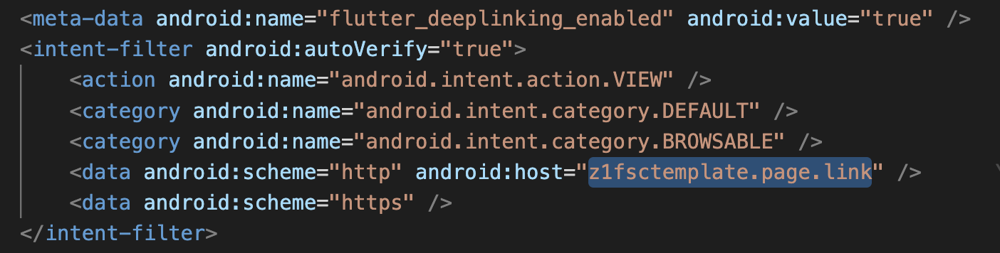

## Using Flutter Template

### Table Content
1. Install Firebase CLI and FlutterFire CLI
2. Configure App to your new Firebase Project
3. Firebase Messaging and Notification Helper
4. Firebase Dynamiclink
5. Firebase Crashlytics
6. Firebase Analytics

#### 1. Install Firebase CLI and FlutterFire CLI
**Why we need to install Firebase CLI?**
We need to install Firebase CLI, because it's the easy way to access to your Firebase Project with just a line of command and you can manage or use other feature fastly.

**Why wee need to install FlutterFire CLI**
With FlutterFire CLI, we can integrate Flutter App to Firebase. And everything will be done in just a minute and you are ready to use Firebase feature as you can. 

Please make sure you have npm installed on your machine, because it's required when install Firebase CLI. If you don't install yet, [See this](https://nodejs.org/en/).

Let's start with Firebase CLI installation

`npm install -g firebase-tools`

**Note:** you need to add sudo as prefix when you install on Mac.

`sudo npm install -g firebase-tools`

Next step it's time to run command for install FlutterFire Cli

`dart pub global activate flutterfire_cli`

To make sure everything works, you can try these command below:
>open terminal and type: firebase if no error you are ready to go

>open terminal and type: flutterfire if also no error you are ready to go

#### 2. Configure App to your new Firebase Project
**MUST DO BEFORE CONFIGURATION:**

for production app you need to set a standard and unique package name or bundle id for android and ios. If you don't know how to change package name, [See this, it may helps you](https://stackoverflow.com/questions/16804093/rename-package-in-android-studio) and change bundle in xcode, [Let's see this](https://stackoverflow.com/questions/16804093/rename-package-in-android-studio)

>example: com.z1fsc.fluttertemplate

and firebase will use this to create app in firebase console.

Now you need to access to your firebase project with command line

**<em>Login to your firebase account</em>**

`firebase login`

then it will open browser and you confirm you email that want to connect. If you areadly login and want to use with another account, then you need to log out first. 

`firebase logout`

To know more about using Firebase Command line, [See this](https://firebase.google.com/docs/cli)

**<em>Config flutter app to firebase with FlutterFire command</em>**

Open your project and go to terminal, and make sure you are in the root of project, then type command:

`flutterfire configure`

Then follow the instruction. [For more](https://firebase.flutter.dev/docs/cli/)

You are done and this step. 
#### 3. Firebase Messaging and Notification Helper

**<em>Firebase Messaging</em>**
For android no more addition setup, but for ios you need to upload APNs to your firebase app in Firebase Console

for APNs is require for Push Notification with Firebase Messsaging, you can Apple Developer Account Holder for this. 

Then you can go to firebase console and upload it. 

**<em>Notification Helper</em>**
Because Firebase Messaging, doesn't works in background (in-app), so we need [Flutter Local Notification](https://pub.dev/packages/flutter_local_notifications) to handle it when user are opening app. 

I have already created Notification Helper class to make it easier and quick. What you need is just call NotificationHelper.init() in your main.dart file then everything will works on both Firebase Messaging and Flutter Local Notification. 

**Ops:** Please make sure that you change notification icon for android. Here is the online generate icon tool if you need, [Go to](https://romannurik.github.io/AndroidAssetStudio/icons-notification.html#source.type=clipart&source.clipart=ac_unit&source.space.trim=1&source.space.pad=0&name=ic_stat_ac_unit)

[Go to notification_helper.dart file](../lib/utils/helper/notification_helper.dart) then change icon name on it. 

Listen any comming notification from Firebase and use Flutter Local Notification to show while user is using app. 

To handle notification when user taps on Notification Alert while app is locked. 

To handle notification when user taps on Notification Alert while user uses app

#### 4. Firebase Dynamiclink
With brand new Firebase Project, you need to enable Dynamiclinks and create your own unique domain. [Go to this link and follow instruction](https://firebase.google.com/docs/dynamic-links/create-links)

To use DeepLink with AutoRout, you need to change your domain for both android and ios.

**<em>For android</em>**

**<em> Adding SHA certificate fingerprints </em>**

To get SHA key, you need to go your Firebase Project Setting and click on Android App

and follow this step to get the key [Click this](https://developers.google.com/android/guides/client-auth)

After you get the key you need to pass it in like this:

After that:
[Go to AndroidManifest.xml](../android/app/src/main/AndroidManifest.xml)

**<em>For ios</em>**

[Go to info.plist](../ios/Runner/Info.plist)

To test deeplink with auto route, [See this](https://docs.flutter.dev/development/ui/navigation/deep-linking)

